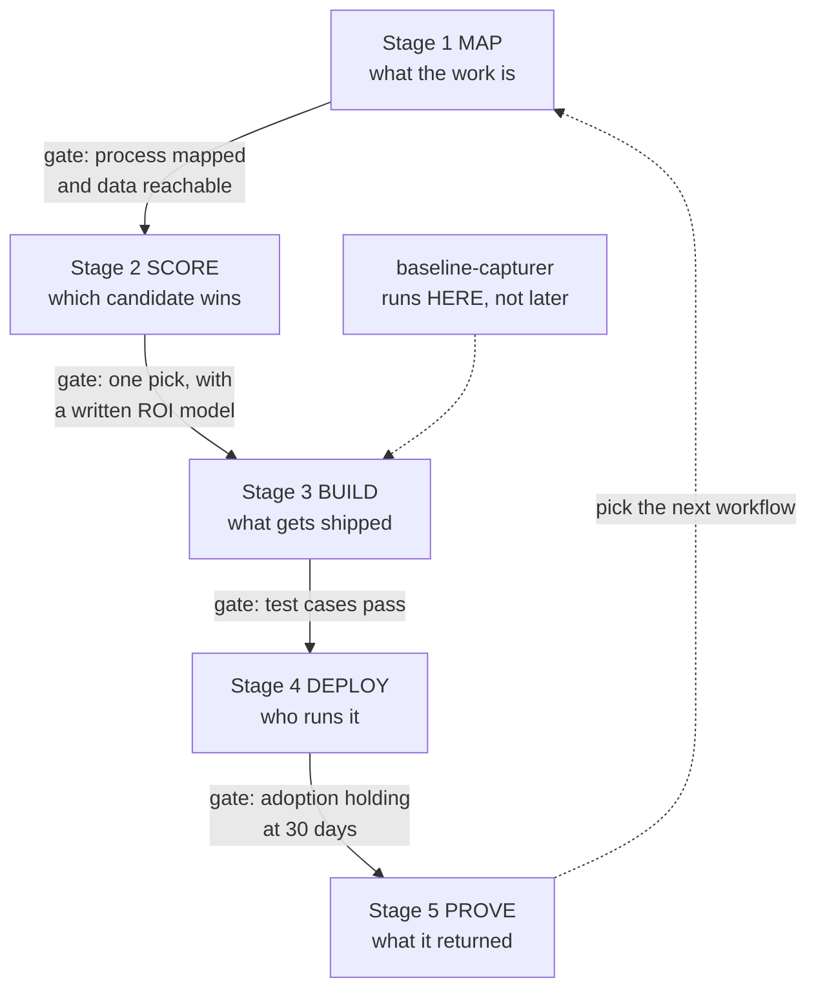

# The Automation Playbook for Claude: 20 Skills That Take One Workflow From Idea to Proven ROI

*Kilde: [The Automation Playbook for Claude](https://impartial-money-fa9.notion.site/The-Automation-Playbook-for-Claude-20-Skills-That-Take-One-Workflow-From-Idea-to-Proven-ROI-3bf9112c6a1f8051bea4cd80b0702cf2) af Anthony Whitaker.*


Hey, I'm Anthony Whitaker. I'm a fractional AI lead for mid-market companies, 50 to 500 people, and I run 90-Day AI ROI Sprints that end in live workflows instead of a strategy deck. Before this I spent about ten years building AI systems at Amazon, Salesforce, Google, and the NFL.

I built this playbook because the thing that stops an AI pilot from becoming a production workflow is almost always sequencing rather than technology. Most teams start building in week one, and then find out in month four that the thing they automated wasn't the expensive part of the process.

So here are 20 Claude skills, arranged in the order the work actually has to happen. Run them in sequence and one workflow goes from a vague complaint to a number your CFO can check.

Every skill below is a complete file you can copy, save, and run. Nothing is withheld for a paid version.

> **Prefer to have this built into your operation instead of DIY?**

> That's the whole point of the 90-Day Sprint: we ship the workflows your team actually uses, with a 3x ROI target and my fees on the line if the math doesn't hold.

> [Book a call →](https://calendly.com/anthonywhitaker/discovery)

---

## What's Inside

1. **Set up the skills.** What a Claude skill is, where the file goes, and the 15 minutes of setup that has to happen before anything else works.

1. **Stage 1, Map.** Four skills that find out what the work actually is, before anyone argues about tools.

1. **Stage 2, Score.** Four skills that pick the one candidate worth building, with the assumptions written down where your team can attack them.

1. **Stage 3, Build.** Four skills that turn the pick into a workflow with inputs, checkpoints, failure paths, and a test gate.

1. **Stage 4, Deploy.** Four skills that get it into real hands and keep it there after the novelty wears off.

1. **Stage 5, Prove.** Four skills that turn the result into a number that survives a hostile question.

1. **The whole thing end to end.** One illustrative company run through all five stages, so you can see the outputs stack.

1. **Running order, timing, and the four ways this falls apart.** The week-by-week sequence and the mistakes I see most.

---

## 1. Set Up the Skills

After this section you'll have all 20 skills installed and know how to call one.

### What a skill actually is

A Claude skill is a folder with a markdown file in it called `SKILL.md`. The file has a short header block, then plain-English instructions telling Claude how to do one specific job. That's the whole format. There's no code and nothing to install on your machine.

The header block matters more than it looks. Claude reads the `description` line to decide when to pull the skill in on its own, so a vague description means a skill that never fires.

Skills are an open standard now, published at [agentskills.io](https://agentskills.io/), so the same files work across more than one AI product. You aren't writing 20 files that only ever work in one place.

### Before you can upload anything

Code execution has to be turned on. On Free, Pro, or Max you do it yourself in Settings under Capabilities. On Team or Enterprise your admin has to enable both Code execution and Skills in Organization settings, and until they do, the Skills menu won't appear at all. If you're on a company account, send your admin that sentence before you read further, because the setup is a five-minute change on their end and a blocked afternoon on yours.

### Installing one skill

1. Make a folder named exactly like the skill. For the first one below, that's `process-mapper`.

1. Put a file inside it called `SKILL.md`. Paste in the block from this playbook.

1. Zip the folder. Zip the folder itself, not the loose files inside it. People get this step wrong. Opening the zip should show one folder, not a `SKILL.md` sitting at the top level.

1. In Claude, go to **Customize → Skills**, click **+**, then **+ Create skill**, then **Upload a skill**, and choose your zip.

1. Repeat for the rest, or zip all 20 folders and upload them one at a time.

> Three things Anthropic hasn't published, so treat them as unknowns rather than assumptions: the exact zip size limit, whether skills work inside Projects, and how much of this works on mobile. None of the 20 files here are big enough to worry about size. Test the other two in your own account before you tell a team to rely on them.

### Calling a skill

Two ways. Type `/process-mapper` to run it deliberately, or just describe your problem and let Claude match your request against the description line and pull the skill in by itself. Deliberate is better while you're learning the sequence, because you want to know which skill produced which output.

For uploads to Claude, the header block accepts a limited set of fields: `name`, `description`, `license`, `compatibility`, `metadata`, and `allowed-tools`. Every file below uses just `name` and `description`. If you've seen other fields in Claude Code documentation, they belong to Claude Code and won't do anything here.

### The five stages

| Stage | The question it settles | The four skills |
| --- | --- | --- |
| **1. Map** | What is the work, step by step, and where do the hours go? | `process-mapper`, `task-inventory`, `bottleneck-finder`, `data-readiness-checker` |
| **2. Score** | Of everything we could automate, which one candidate wins? | `impact-scorer`, `feasibility-rater`, `roi-modeler`, `risk-screener` |
| **3. Build** | What exactly gets shipped, and how do we know it works? | `workflow-architect`, `agent-spec-writer`, `integration-mapper`, `test-case-generator` |
| **4. Deploy** | Who runs it, what happens when it breaks, and is anyone using it? | `rollout-sequencer`, `sop-rewriter`, `owner-escalation-designer`, `adoption-tracker` |
| **5. Prove** | What did it actually return, and can we defend the number? | `baseline-capturer`, `kpi-architect`, `savings-auditor`, `board-memo-writer` |



> Note where `baseline-capturer` sits in that diagram. It's a Stage 5 skill by purpose and a Stage 2 skill by timing. Run it before a single line of the workflow gets built, because once the automation is live you can't go back and measure what the old way cost. This is the single most common reason a working automation can't be defended to a board.

---

## 2. Stage 1, Map

After this stage you'll have a written map of one process, broken into tasks, with the waiting time separated from the working time, and a clear read on whether the data an automation would need is actually reachable.

Most AI projects skip straight past this. Someone says "our order entry is a mess," a tool gets bought, and four months later the mess has moved rather than shrunk. The four skills below cost you about a week and they're the reason the rest of the sequence holds up.

### 1.1 Process Mapper

**What it does.** Interviews you about one process and turns it into a numbered map: every step, who does it, which system they're in, what triggers it, and roughly how long it takes.

**Feed it.** The name of the process and whatever you know. Half-answers are fine. The skill's job is to ask for the rest.

**You get back.** A step-by-step map with an actor, a system, a trigger, and a time estimate on each step, plus a list of what you couldn't answer.

**Why it's first.** Nobody in the building has the whole process in their head. The inside sales rep knows steps 1 through 6, the controller knows 11 and 12, and steps 7 through 10 are where the money leaks.

```
---
name: process-mapper
description: Turns a vaguely described business process into a numbered step-by-step map with actor, system, trigger, and time per step. Use before scoping any automation, AI pilot, or workflow redesign.
---

# Process Mapper

Your job is to produce a defensible map of one business process. You are not solving it, improving it, or recommending tools. You are writing down what happens today.

## Procedure

1. Ask which single process to map. If the user names something broad like "sales" or "finance," narrow it to one repeating unit of work with a clear start and end, for example "a customer order from email arrival to ERP confirmation." Do not proceed until the boundaries are named.

2. Establish the trigger and the end state. What starts one instance of this process, and what condition means it's done? Write both down verbatim.

3. Walk forward one step at a time. For each step, ask for and record: what happens, who does it (role, not name), which system or tool they're in, what has to be true before they can start, how long the step takes, and how often the step happens per week or month.

4. Ask directly about the parts people leave out: rework loops, exceptions, approvals that wait on one person, and any step that involves retyping something that already exists somewhere else.

5. Ask who else would describe this differently. Note their role. A map from one person is a draft.

## Output format

A markdown table with columns: Step, What happens, Actor, System, Trigger or precondition, Minutes per instance, Instances per week.

Below the table, three sections:

- **Volume and time.** Total minutes per week across all steps, shown as a calculation, not a claim.
- **Unknowns.** Every field you could not fill, and who would know.
- **Contradiction risk.** Steps where the user hedged, guessed, or where a second interviewee is likely to disagree.

## Rules

- Never estimate a time the user did not give you. Write "unknown" and list it.
- Record the process as it is, including the ugly workarounds. Do not tidy it into how it's supposed to work.
- If the user starts proposing solutions, note the idea in a parking lot section and return to mapping.
- No step count target. Some processes are 6 steps and some are 40.
```

### 1.2 Task Inventory

**What it does.** Takes the map and splits each step into the individual tasks inside it, then classifies each task by type. Task type is the best single predictor of whether AI can do it, better than industry, department, or software vendor.

**Feed it.** The output of `process-mapper`.

**You get back.** A task-level inventory where every task is tagged retrieve, transcribe, decide, judge, or communicate, with a note on what a wrong answer would cost.

**Why it matters.** "Automate order entry" is not a thing you can build. "Read the PDF, extract eleven fields, match the part numbers against the catalog, flag the ones that don't match" is four buildable things with different risk profiles.

```
---
name: task-inventory
description: Breaks mapped process steps into individual tasks and classifies each as retrieve, transcribe, decide, judge, or communicate, with the cost of a wrong answer. Use after process mapping, before scoring automation candidates.
---

# Task Inventory

Your job is to decompose a process map into tasks and classify each one. Classification drives everything downstream, so be strict about it.

## The five task types

- **Retrieve.** Find and return existing information. Low judgment, high volume. Usually the safest automation.
- **Transcribe.** Move information from one format or system to another. Includes reading documents and typing into forms. Verifiable against a source, which makes it testable.
- **Decide.** Apply a written rule to inputs and produce an outcome. Automatable when the rule is genuinely written down. If the rule lives in someone's head, it's a judge task until it gets written.
- **Judge.** Weigh factors without a fixed rule. Requires human review, sometimes permanently. Assist rather than automate.
- **Communicate.** Draft or send something to a person. Drafting automates well. Sending without review rarely should.

## Procedure

1. Take the process map. For each step, list every discrete task inside it. A step usually holds two to five tasks. If a step yields one task, check whether the map was written at the task level already.

2. Assign exactly one type per task. When a task looks like two types, split it. "Review the invoice and approve it" is a retrieve plus a judge.

3. For each task, record: minutes per instance, instances per week, and whether the output is verifiable against a source of truth.

4. For each task, ask what a wrong answer costs. Use four levels: cosmetic, rework, customer-visible, regulatory or financial. Do not skip this. It decides the review posture later.

5. Flag every decide task where the rule is not written down anywhere. These are the most common false positives in AI scoping.

## Output format

A table: Task, Parent step, Type, Minutes per instance, Instances per week, Verifiable (yes/no), Cost of a wrong answer.

Then:

- **Weekly minutes by type.** Which type holds the most time.
- **Unwritten rules.** Every decide task with no documented rule, and who would need to write it.
- **Do not automate.** Judge tasks with customer-visible or regulatory consequences, listed plainly.

## Rules

- One type per task. No hybrids.
- Do not upgrade a judge task to a decide task because automating it would be convenient.
- If minutes or volumes are unknown, write unknown. Do not interpolate.
```

### 1.3 Bottleneck Finder

**What it does.** Separates touch time from wait time. Touch time is someone working. Wait time is the request sitting in a queue while nobody touches it. In most mid-market processes the wait time is several times larger, and it's invisible on a process map.

**Feed it.** The process map and the task inventory.

**You get back.** A ranked list of where the calendar time actually goes, and a note on which delays automation would fix versus which are staffing or policy problems wearing a technology costume.

**Why it matters.** If your five-day order cycle is four days of queue and one hour of typing, automating the typing gets you a four-day-and-one-minute cycle. Worth knowing before you build.

```
---
name: bottleneck-finder
description: Separates touch time from wait time in a mapped process, ranks where calendar time is actually lost, and distinguishes delays automation can fix from staffing or policy problems. Use after task inventory.
---

# Bottleneck Finder

Your job is to find where the process waits, not where it works. These are different problems with different fixes, and conflating them is how automation projects miss their target.

## Definitions

- **Touch time.** A person or system actively working on the item.
- **Wait time.** The item exists and nothing is happening to it. Queues, inbox backlogs, "waiting for approval," overnight batch gaps, someone on PTO.
- **Cycle time.** Touch plus wait, start to finish, in calendar hours.

## Procedure

1. From the map and inventory, total the touch time per instance.

2. Ask the user for actual cycle time, start to finish, in calendar hours or days. If they don't know, ask them to pull ten recent instances and check timestamps. Do not estimate this for them.

3. Wait time is cycle time minus touch time. Present the ratio.

4. Locate the wait. For each handoff between steps, ask how long items typically sit. Ask specifically about: single-approver dependencies, work that only moves during business hours, batch processes that run once a day, and steps where one person is the only one who can act.

5. Classify each delay by its actual cause:
   - **Capacity.** Not enough people for the volume. Automation helps if it removes touch time from the constrained role, and only then.
   - **Sequence.** Steps run one after another that could run at the same time. Redesign, not automation.
   - **Authority.** Waiting on a decision only one person can make. Delegation or a written rule, not automation.
   - **Availability.** The system or the person isn't reachable. Scheduling or integration.
   - **Rework.** The item goes backward. Fix the upstream quality problem first.

6. Rank delays by calendar hours lost per week.

## Output format

- **The ratio.** Touch time versus wait time per instance, with the arithmetic shown.
- **Ranked delays table:** Where it waits, Cause type, Hours lost per week, Would automation fix it (yes / partly / no), What would actually fix it.
- **The honest note.** If automating every touch-time task would cut cycle time by less than 20 percent, say so in one sentence at the top of your response. Do not bury it.

## Rules

- Never label a capacity problem as an automation opportunity without saying which role's hours get freed.
- If cycle time data doesn't exist, say the analysis is blocked and name the ten instances that need pulling. Don't guess a ratio.
```

### 1.4 Data Readiness Checker

**What it does.** For each automation candidate, works out what data the automation needs, where that data lives, whether it can be reached, and whether it's clean enough to act on.

**Feed it.** The task inventory, plus whatever you know about your systems.

**You get back.** A per-candidate readiness verdict, the specific access or cleanup work required before a build could start, and who owns each system.

**Why it matters.** "Our data is too messy" is the most common reason mid-market leaders don't start, and it's usually wrong at the process level and right at the enterprise level. You don't need clean data everywhere. You need reachable, good-enough data for one workflow.

```
---
name: data-readiness-checker
description: Determines what data an automation candidate needs, where it lives, whether it is reachable and clean enough, and what access or cleanup is required first. Use before committing to an automation build.
---

# Data Readiness Checker

Your job is to find out whether the data an automation needs is actually available, at the level of one specific workflow. Enterprise-wide data maturity is not the question.

## Procedure

For each automation candidate:

1. **List the inputs.** What information does the automation need to read in order to do the task? Be specific down to the field, for example "customer part number as written on the incoming PO," not "order data."

2. **List the outputs.** What does it write, and where? Which system, which field, which format.

3. **For every input and output, establish five things:**
   - Where does it live? Name the system.
   - How would software reach it? API, database, file export, email, screen scrape, or not at all.
   - Who controls access, by role?
   - How current is it? Live, daily, or as of whenever someone last updated the spreadsheet.
   - How reliable is it? Ask for a rough error or blank rate. If the user doesn't know, this is an unknown, not a zero.

4. **Grade each input** as ready, reachable with work, or blocked. Reachable with work means a named piece of setup: an API key, a permission grant, a nightly export, a vendor call.

5. **Check the reference data separately.** Automations that classify, match, or validate need a source of truth: a price list, a customer master, a catalog, an approval matrix. Ask whether one exists, who maintains it, and how stale it is. A missing source of truth kills more automations than a missing API.

6. **Grade the candidate overall.** The candidate is only as ready as its least ready required input.

## Output format

Per candidate, a table: Input or output, System, Access method, Access owner, Freshness, Reliability, Grade.

Then:

- **Overall grade** with a one-line reason.
- **Prerequisite work**, as a checklist of named tasks with an owner role and a rough effort in days.
- **Source of truth check.** What the automation validates against, who owns it, and whether it's trustworthy.
- **Blocked items.** What genuinely cannot be reached, and what the workaround costs.

## Rules

- Do not assume a system has a usable API. Ask, or mark it unknown.
- "We could export to CSV" is a valid access method. Say what breaks when someone forgets to run it.
- Never grade a candidate ready when a required input is unknown.
```

---

## 3. Stage 2, Score

After this stage you'll have one candidate chosen out of many, with an impact score, a feasibility score, a written ROI model with the assumptions exposed, and a risk posture that tells you how much human review the thing needs.

This is the stage that gets skipped in favor of enthusiasm, and skipping it is the reason so many pilots die quietly. The four skills here are what let you say no to nineteen ideas without a fight, because the reasoning is on paper.

### 2.1 Impact Scorer

**What it does.** Scores every candidate on four dimensions of value: hours, error cost, cycle time, and revenue exposure. Each score has to carry a stated basis, so an eyeball opinion can't hide inside a number.

**Feed it.** The task inventory and the bottleneck ranking.

**You get back.** A scored, ranked candidate list, and a separate list of the ones that only look valuable because they're annoying.

```
---
name: impact-scorer
description: Scores automation candidates on hours reclaimed, error cost, cycle-time reduction, and revenue exposure, requiring a stated basis for every score. Use after task inventory to rank candidates by value.
---

# Impact Scorer

Your job is to score the value side only. Feasibility, cost, and risk are scored by other skills. Keep them out of your reasoning here.

## The four dimensions

Score each 1 to 5. Every score needs a basis in one sentence, drawn from the inventory data or from something the user told you. A score with no basis is written as "unscored," not as 3.

1. **Hours reclaimed per year.** From the inventory: minutes per instance times instances per year, times the share of the task realistically automatable. Be conservative on that share and state it.
2. **Error cost.** What do mistakes in this task cost today, in rework, credits, write-offs, or customer churn? Use the cost-of-a-wrong-answer field from the inventory.
3. **Cycle-time reduction.** How much calendar time comes out, per the bottleneck analysis. A task with high touch time but no effect on cycle time scores low here, and that's correct.
4. **Revenue exposure.** Does this task sit between a customer and a purchase, a renewal, or a payment? Quote-to-cash and inbound response tasks score high. Internal reporting scores low.

## Procedure

1. Score each candidate on all four. State the basis for each.
2. Compute a total. Weight hours and error cost at 1.0, cycle time at 1.5, revenue exposure at 1.5, because in mid-market operations the constraint is usually speed and revenue capture rather than labor cost. Show the weighting so the user can change it and re-run.
3. Rank by weighted total.
4. Separate out the **annoyance trap**: candidates the user described with frustration but that score under 8 weighted. Name them and say plainly that they're irritating rather than expensive.
5. Name the top three and, in one sentence each, say what makes them valuable.

## Output format

A table: Candidate, Hours (score + basis), Error cost (score + basis), Cycle time (score + basis), Revenue exposure (score + basis), Weighted total.

Then **Top three**, **The annoyance trap**, and **Unscored**, listing what data would be needed to score them.

## Rules

- Never invent a volume, a rate, or a dollar figure. Unscored is an acceptable answer.
- Do not adjust a score because a candidate seems hard to build. That's the feasibility skill's job.
- If the user pushes for a favorite to rank higher, ask which input they want to change and re-run. Do not quietly re-weight.
```

### 2.2 Feasibility Rater

**What it does.** Scores the same candidates on how hard they'd be to build and keep running, using five dimensions that predict trouble better than "how complex is it."

**Feed it.** The candidate list, the task types, and the data readiness grades.

**You get back.** A feasibility score per candidate and a 2x2 placement against impact, which is where the actual pick comes from.

```
---
name: feasibility-rater
description: Rates automation candidates on task-type fit, data access, integration difficulty, review burden, and change resistance, then plots feasibility against impact. Use after impact scoring.
---

# Feasibility Rater

Your job is to rate how hard each candidate is to build, ship, and keep alive. Ignore how valuable it is.

## The five dimensions

Score each 1 (very hard) to 5 (easy), with a one-sentence basis.

1. **Task-type fit.** Retrieve and transcribe score 4 to 5. Decide with a written rule scores 3 to 4. Decide with an unwritten rule scores 2. Judge scores 1 to 2.
2. **Data access.** Straight from the readiness grades. Ready is 5, reachable with work is 3, blocked is 1.
3. **Integration difficulty.** How many systems does it write to, and how? One system with an API is 5. Three systems, one of which is a desktop application from 2009, is 1.
4. **Review burden.** How much human checking does the output need, forever, not just during rollout? No review needed is 5. Every output checked by a person is 1. Be honest here: a task that always needs full review saves less than it looks like.
5. **Change resistance.** How much does the way people work have to change, and does anyone lose status or headcount in the process? No behavior change is 5. A role has to be redefined is 1. Ask the user directly who would resist and why.

## Procedure

1. Score all five per candidate with a basis each.
2. Average for a feasibility score.
3. Plot against the impact score in a four-quadrant table:
   - **Build now.** High impact, high feasibility.
   - **Worth the setup.** High impact, low feasibility. Name the specific prerequisite that would move it.
   - **Cheap wins.** Low impact, high feasibility. Fine as a second workflow, wrong as a first one.
   - **Leave it.** Low impact, low feasibility. Say so and stop discussing it.
4. Recommend one candidate. One. If two are close, name the tiebreaker you used.

## Output format

The five-dimension table, the quadrant placement, and **The recommendation**: one candidate, three sentences on why, and one sentence naming the biggest thing that could go wrong with it.

## Rules

- Score review burden on the steady state, not on the pilot.
- Change resistance is a real engineering constraint. Do not soften it because it's a people problem.
- If every candidate lands in "leave it," say that. Recommending the least bad option out of a weak field wastes 90 days.
```

### 2.3 ROI Modeler

**What it does.** Builds the financial case for the chosen candidate as a model rather than a claim: baseline cost, expected reduction as a range, build cost, run cost, payback period, and every assumption tagged by how much you actually know.

**Feed it.** The recommendation, the volumes, and your real labor and system costs.

**You get back.** A three-scenario model, a payback month, and an assumption register your CFO can attack line by line.

**Why it matters.** A single number is a claim, and claims get argued about. A range with labeled assumptions is a model, and models get corrected. Correcting is much better for you.

```
---
name: roi-modeler
description: Builds a defensible ROI model for one automation candidate with baseline cost, low/expected/high savings scenarios, build and run costs, payback period, and a confidence-tagged assumption register. Use after picking a candidate.
---

# ROI Modeler

Your job is to build a model the finance team can audit, not a number that sounds good. Every input is either provided by the user or explicitly flagged as an assumption.

## Procedure

1. **Baseline cost.** Establish today's annual cost of the task. Ask for: fully loaded hourly cost of the roles involved, hours per year from the inventory, plus any direct costs (overtime, temps, outsourced processing, error credits, software licences tied to the manual method). If the user doesn't have fully loaded cost, ask for salary and apply a stated multiplier for benefits and overhead. Say what multiplier you used.

2. **Savings, as three scenarios.** For each, state the percent of the task the automation handles and the percent of freed time that converts to something of value.
   - **Low.** Partial automation, heavy review, slow adoption.
   - **Expected.** Your honest central case.
   - **High.** Full automation, light review, fast adoption.

3. **Convert freed hours honestly.** This is where most models break. Ask which of these applies, and use the user's answer rather than assuming:
   - Hours are redeployed to revenue work. Count the revenue contribution, not the salary.
   - Hours avoid a planned hire. Count the avoided salary, with the hire date.
   - Hours reduce overtime or temp spend. Count the actual line item.
   - Hours just make the day less painful. Count zero cash, and label it capacity or retention. Say this plainly.

4. **Build cost.** Internal hours by role times loaded rate, plus external help, plus tooling and licences, plus the prerequisite work from the readiness checklist. Include the prerequisite work. People leave it out and it's often the biggest line.

5. **Run cost.** Annual model or platform usage, ongoing human review time, maintenance hours, and the cost of re-testing when an upstream system changes.

6. **The model.** Year one net, year two net, payback in months, and the ratio of year-one net benefit to total year-one cost. State the ratio against whatever target the user has. If they have none, use 3x and say you chose it.

7. **Assumption register.** Every assumption, tagged: **known** (user gave you a real figure), **estimated** (user's best guess), or **guessed** (you supplied it because nothing else existed). Then name the three assumptions the whole model is most sensitive to, and what happens to payback if each is 50 percent worse.

## Output format

A scenario table, the payback calculation shown as arithmetic, the assumption register, and a **sensitivity** section with the three fragile assumptions.

## Rules

- Never present a point estimate as the answer. Three scenarios or nothing.
- Never count the same hour twice, and never count freed hours as cash when the user says nobody's leaving and no hire is being avoided.
- If more than a third of the register is tagged "guessed," open your response by saying the model isn't ready to present and listing what to go measure.
```

### 2.4 Risk Screener

**What it does.** Screens the candidate for regulatory, privacy, contractual, and consequence risk, then assigns a review posture: how much human checking the workflow needs and where.

**Feed it.** The candidate, the task types, the data inventory, and your industry.

**You get back.** A risk register and a specific review design, which becomes a hard requirement for the build stage.

```
---
name: risk-screener
description: Screens an automation candidate for regulatory, privacy, contractual, consequence, and reputational risk, then assigns a human review posture and logging requirements. Use before building, and revisit before go-live.
---

# Risk Screener

Your job is to find what could go wrong and translate it into review requirements the build has to satisfy. You are not a lawyer and you say so once, plainly, then get on with the work.

## Screen these six

1. **Regulatory.** What rules govern this data or decision in the user's industry and geography? Ask what regime applies rather than assuming. Flag anything touching health information, financial advice, credit or lending decisions, employment decisions, or safety-critical instructions.
2. **Personal data.** Does the workflow read, store, or transmit personal information? Whose? Is it moving somewhere it hasn't been before, and is that somewhere covered by an existing agreement?
3. **Contractual.** Do customer or vendor contracts say anything about automated processing, data handling, subcontractors, or where data can sit? Ask whether anyone has checked. Usually nobody has.
4. **Consequence of a wrong output.** Take the worst plausible error, not the average one. Who is harmed, how much, how fast is it caught, and is it reversible?
5. **Detection.** If the automation is quietly wrong for a month, what surfaces it? If the answer is "a customer complains," that's a finding, not an answer.
6. **Reputation and internal trust.** Would this look bad in writing if it went wrong? Would one visible failure end the appetite for the next workflow?

## Review posture

Assign one per automated step, not one for the whole workflow:

- **Autonomous.** No human review. Only for reversible, verifiable, low-consequence steps with a working detection signal.
- **Sample audit.** A defined percentage reviewed on a schedule. State the percentage and who reviews.
- **Human in the loop.** Every output reviewed before it takes effect. State who, and what they're checking for.
- **Assist only.** The automation drafts, a human always decides. Correct for every judge task with real consequences.

## Output format

- **Risk register:** Risk, Category, Likelihood (low/medium/high with a reason), Consequence, Existing control, Required control.
- **Review posture per step**, as a table.
- **Logging requirements.** What must be recorded for every run so an error can be reconstructed. Non-negotiable where regulated data is involved.
- **Stop conditions.** What would make you say don't build this. Be willing to say it.
- **Escalate to a human expert.** Which specific questions need your legal, compliance, or security people before go-live, phrased so they can answer without reading this whole document.

## Rules

- Never conclude that no regulation applies. Say which you checked and which you couldn't assess.
- Where the user says "we've always done it this way," treat that as an uncontrolled risk rather than a control.
- Review posture is a floor, not a suggestion. The build stage inherits it as a requirement.
```

> **That's the hard half done, and it's the half most teams never do.**

> If you'd rather not run four weeks of scoring and modeling yourself, the 90-Day Sprint opens with exactly this: process mapped, candidates scored, one workflow picked, and an ROI model your CFO can audit before anyone builds anything.

> [Book a call →](https://calendly.com/anthonywhitaker/discovery)

---

## 4. Stage 3, Build

After this stage you'll have a runtime design for the workflow, the actual production prompts for every automated step, a map of every system it touches, and a set of test cases that has to pass before anyone goes live.

### 3.1 Workflow Architect

**What it does.** Turns the chosen candidate into a design you could hand to a builder: trigger, inputs, each step in order, where humans check the work, what the outputs are, and what happens on every failure path.

**Feed it.** The candidate, the task inventory, the review posture from the risk screener, and the integration constraints.

**You get back.** A runtime spec plus a diagram, with failure handling designed in rather than added after the first outage.

```
---
name: workflow-architect
description: Turns a chosen automation candidate into a runtime design with trigger, inputs, ordered steps, human checkpoints, outputs, and a failure path for every step. Use after scoring and risk screening, before writing any prompts.
---

# Workflow Architect

Your job is to design how the workflow runs, once, in production, including the times it goes wrong. A design without failure paths isn't a design.

## Procedure

1. **Trigger.** What starts a run? An inbound email, a file landing in a folder, a schedule, a record changing state, a person clicking something. Be exact. Name what happens if two triggers fire at once for the same item.

2. **Inputs.** Every piece of data the run needs at the start, where it comes from, and what the workflow does when one is missing or malformed. Missing input handling is not optional.

3. **Steps, in order.** For each: what it does, whether a human or the automation performs it, what it produces, and what the next step needs from it. Number them.

4. **Human checkpoints.** Place them according to the review posture from `risk-screener`, which you inherit as a requirement rather than a suggestion. For each checkpoint, state who reviews, what they're checking, how long they have, and what happens if they don't respond in time. Silent stalls at checkpoints are the most common way a live workflow dies.

5. **Outputs.** What the run produces, where it goes, and what confirms it landed. If the workflow writes to a system of record, name what verifies the write.

6. **Failure paths.** For every step, answer three questions: how do we know it failed, what does the workflow do next, and who finds out? Cover at least these cases: an input is missing, a source system is unavailable, the model output fails validation, the confidence is low, the human reviewer doesn't respond, and the same item gets processed twice.

7. **Escape hatch.** How does a person stop a run mid-flight, and how do they finish the item manually? Every workflow needs a manual path that still works, and it needs to be written down before go-live rather than discovered during one.

8. **Validation rules.** For each automated output, what makes it obviously wrong? Field formats, value ranges, required matches against a source of truth, totals that have to reconcile. These become the test cases.

## Output format

- **Runtime spec** with the eight sections above.
- **A mermaid flowchart** showing the happy path as solid lines and failure paths as dotted lines, with human checkpoints as distinct nodes.
- **Open design questions** the user has to answer before a build starts, each with the name of the role who can answer it.

## Rules

- No step without a failure path.
- Never design away a human checkpoint the risk screener required. If you think one is unnecessary, say so and leave it in the design for the user to remove deliberately.
- Prefer boring designs. A workflow with two model calls and a validation rule beats one with six chained calls and no way to see where it broke.
```

### 3.2 Agent Spec Writer

**What it does.** Writes the actual production prompt for each automated step: role, inputs, procedure, output schema, validation, and the conditions where it must refuse rather than guess.

**Feed it.** The runtime spec, one step at a time.

**You get back.** A paste-ready prompt per step, with the output format specified tightly enough that a downstream system can consume it.

**Why it matters.** The prompt that works in a demo is a paragraph. A production prompt names its inputs, constrains its output, knows when to stop, and says so when it isn't sure. This skill writes the second kind.

```
---
name: agent-spec-writer
description: Writes the production prompt for one automated workflow step, with role, inputs, procedure, strict output schema, validation rules, and explicit refusal conditions. Use once per automated step in a runtime design.
---

# Agent Spec Writer

Your job is to write one production prompt for one step. Not a workflow, not a general assistant. One step with one output.

Ask which step you're writing for, and get the step definition from the runtime spec before you write anything.

## The seven required parts

1. **Role.** One sentence naming what this step does and the domain it operates in. No personality, no "you are a world-class expert."

2. **Inputs.** Every input named, with its format and whether it's required. State exactly what to do when a required input is missing: refuse and report, never proceed on a substitute.

3. **Procedure.** Numbered steps the model follows. Deterministic where possible. If there's a rule from the business, quote it verbatim rather than paraphrasing it, and cite where it came from so it can be updated when the business changes it.

4. **Output schema.** The exact structure of the output, field by field, with types and allowed values. Where a downstream system consumes it, specify JSON with named keys and say that no prose may appear outside the structure. Loose output is the main reason these break in production.

5. **Validation rules.** What the step checks before returning: formats, ranges, required matches against a source of truth, internal consistency. When a check fails, the step returns a structured error rather than its best guess.

6. **Refusal conditions.** The explicit list of situations where the step must decline and hand off to a human. At minimum: a required input is missing, the input is ambiguous between two readings, the value falls outside a stated range, the source of truth has no match, or the task drifts outside the step's defined scope. Write the exact handoff message.

7. **Confidence reporting.** How the step signals that it's unsure. A field in the output, with a defined scale and a threshold that routes to human review. "Guess and stay quiet" is the failure mode you're designing against.

## Procedure

1. Get the step definition, the inputs, the review posture, and the validation rules from the runtime spec.
2. Draft the prompt with all seven parts.
3. Write three example inputs with their correct outputs, including one that should trigger a refusal.
4. Note every business rule you had to quote, and flag any the user hasn't actually written down yet. Those are blockers, not details.

## Output format

The prompt in a single code block, ready to paste. Then the three worked examples, then a short list of what the user must confirm before this ships.

## Rules

- Never write a prompt that can silently produce a plausible wrong answer. If validation can't catch a class of error, say so and send that class to human review.
- Quote business rules exactly. Paraphrasing a pricing rule is how you get a wrong invoice.
- One step, one prompt. If the step needs two prompts, tell the user the runtime spec should be split.
```

### 3.3 Integration Mapper

**What it does.** Maps every system the workflow touches, in both directions, with the authentication, the limits, the owner, and the behavior when that system is down.

**Feed it.** The runtime spec and the data readiness output.

**You get back.** An integration table, a list of access requests with named owners, and the failure behavior per system.

**Why it matters.** Automations don't usually fail on the AI. They fail because a password rotated, a rate limit hit at month end, or nobody told the workflow that the ERP goes down every Sunday at 2am for maintenance.

```
---
name: integration-mapper
description: Maps every system an automated workflow reads from or writes to, with access method, auth, rate limits, owner, environments, and failure behavior per system. Use after the runtime design, before build.
---

# Integration Mapper

Your job is to document every connection the workflow depends on and what happens when each one fails.

## Procedure

For each system in the runtime spec, establish:

1. **Direction.** Read, write, or both. List the specific fields or objects, not just the system name.
2. **Access method.** API, database connection, file drop, email, RPA on the interface, or manual. Note the version or endpoint if known.
3. **Authentication.** What credential type, who holds it, where it's stored, and when it expires or rotates. Credential expiry is the single most common cause of a workflow that worked for three months and then stopped.
4. **Limits.** Rate limits, batch size caps, payload limits, licence seat constraints. Ask what happens at month end or quarter end when volume spikes.
5. **Owner.** The role who can grant access and the role who gets paged when it breaks. Names optional, roles required.
6. **Environments.** Is there a test or sandbox instance? If not, say plainly that testing will happen against production and what precautions that demands.
7. **Availability.** Scheduled maintenance windows, known downtime patterns, business-hours-only constraints.
8. **Failure behavior.** When this system is unreachable, what should the workflow do: retry with a stated backoff, queue and continue, or stop and alert? Pick one per system.
9. **Change risk.** Who could change this system without telling anyone, and what would break. Vendor upgrades, admin field changes, someone renaming a column.

## Output format

- **Integration table** with the nine fields above, one row per system.
- **Access request list.** A checklist of every credential, permission, or connection to be arranged, with the owner role and what to ask them for, written so the user can forward it directly.
- **Failure matrix.** System down, what the workflow does, who's notified, expected time to recover.
- **Single points of failure.** Any system where an outage stops the workflow completely and there's no manual path.

## Rules

- Never assume an API exists or that a sandbox is available. Ask, or mark unknown.
- Always ask when credentials expire. Always.
- If a system is only reachable by screen automation, say that the integration is fragile and will break on the next interface change.
```

### 3.4 Test Case Generator

**What it does.** Writes the test cases that have to pass before go-live, including the ugly ones nobody thinks of, each with an expected behavior.

**Feed it.** The runtime spec, the step prompts, and the validation rules.

**You get back.** A numbered test set grouped by category, a pass threshold, and a written go-live gate.

**Why it matters.** This is the gate that separates a pilot from a production system. Without a written pass threshold, "it seems to be working" becomes the launch criterion, and the first real failure lands in front of a customer.

```
---
name: test-case-generator
description: Generates a full test set for an automated workflow, covering happy path, edge cases, adversarial inputs, integration failures, and refusal behavior, with expected outcomes and a go-live pass threshold. Use before go-live.
---

# Test Case Generator

Your job is to write the test set that has to pass before this workflow touches real work, and to define the threshold that counts as passing.

## The six categories

Generate cases across all six. Skew the count toward the last four, because that's where production failures live.

1. **Happy path.** The normal case, two or three variants.
2. **Edge cases.** Legitimate but unusual inputs: the biggest order anyone's placed, a customer with no history, a document with an odd layout, a field in an unexpected unit or currency, a name with characters outside the usual set, a date at a period boundary.
3. **Bad inputs.** Missing required fields, wrong format, empty file, duplicate submission, truncated document, two conflicting values for the same field.
4. **Adversarial inputs.** Content designed to make the step do something it shouldn't: instructions embedded in a document the step is reading, a value that would pass validation but be commercially wrong, a request that drifts outside the step's scope.
5. **Integration failures.** Each system unreachable, each credential expired, a timeout mid-run, a partial write, the same item processed twice.
6. **Refusal and handoff.** Every refusal condition from the step prompts, verified to actually trigger. Plus the human checkpoint stalling, so you can confirm the timeout path works.

## Procedure

1. Pull the validation rules and refusal conditions from the step prompts. Every single one gets at least one test.
2. Write each case as: number, category, input description, expected behavior, and how a person verifies the result.
3. Mark each case **blocking** or **non-blocking**. Blocking cases are ones where a failure means no go-live, no exceptions. Every case in categories 4, 5, and 6 that touches a customer or a system of record is blocking.
4. Ask the user for ten to twenty real historical instances to run as a regression set, including any known nightmare cases. Real data finds things invented cases don't.
5. Define the go-live gate: all blocking cases pass, plus a stated pass rate on the regression set, plus a named person who signs off. Make the sign-off a person, not a committee.

## Output format

- **Test table:** Number, Category, Input, Expected behavior, Verified how, Blocking (yes/no).
- **Regression set request.** Exactly what historical data to pull and how many instances.
- **Go-live gate**, written as a short paragraph the sponsor can approve.
- **Known gaps.** What you cannot test before go-live, and what to watch in the first two weeks instead.

## Rules

- Never write a test with a vague expected behavior. "Handles it gracefully" isn't testable. Say what the output should be.
- Every refusal condition gets a test. If a refusal was never verified, assume it doesn't work.
- If the user wants to launch with blocking cases failing, write down which ones and who decided. That record protects everyone.
```

---

## 5. Stage 4, Deploy

After this stage the workflow is in real hands, the written procedure reflects it, someone's name is on it, and you can tell within a week if people have quietly gone back to the old way.

Deployment is where most of the value gets lost, and almost never for technical reasons. The four skills here are about ownership, procedure, and adoption.

### 4.1 Rollout Sequencer

**What it does.** Designs a phased rollout with entry and exit criteria for each phase, so moving forward is a decision based on evidence instead of a feeling.

**Feed it.** The runtime spec, the test results, and the volumes.

**You get back.** A four-phase plan with criteria, duration, volume, and a rollback trigger per phase.

```
---
name: rollout-sequencer
description: Designs a phased automation rollout (shadow, assisted, limited, full) with entry criteria, exit criteria, duration, volume, and rollback triggers per phase. Use after tests pass, before go-live.
---

# Rollout Sequencer

Your job is to design the ramp from zero to full volume so that every step forward has a written reason.

## The four phases

1. **Shadow.** The automation runs on real inputs and its output is compared against what the human did. Nothing the automation produces takes effect. This is the only phase that gives you a clean accuracy read.
2. **Assisted.** The automation drafts, a person reviews every output before it takes effect. Real work, full review.
3. **Limited.** The automation acts on a defined slice at the review posture from `risk-screener`. Pick the slice deliberately: one customer segment, one product line, one shift, one branch.
4. **Full.** Normal volume at the designed review posture, with the monitoring from `adoption-tracker` running.

## Procedure

For each phase define:

- **Entry criteria.** What must be true to start. Phase one entry is the go-live gate from `test-case-generator`.
- **Exit criteria.** Numbers, not impressions. Accuracy against the human baseline, count of clean runs, count of distinct input variations seen, reviewer override rate below a stated level.
- **Duration and volume.** Calendar time and instance count. Both, because two days at low volume proves nothing.
- **Who's involved.** Which roles, how much of their time, and whether they've been told.
- **What gets measured.** Specific fields captured every run, so the exit decision has data.
- **Rollback trigger.** The condition that sends this back a phase, written before you start. Reversing course is much easier when the trigger was agreed in advance.

Then:

1. Choose the limited-phase slice and justify it. Prefer a slice with decent volume, a tolerant internal customer, and low consequence for error.
2. Name the sponsor who approves each phase transition. One person.
3. Say plainly how long the whole ramp takes, and don't compress the shadow phase to hit a date. It's the phase carrying the accuracy evidence.

## Output format

A phase table with the seven fields above, then **The slice** with its justification, then **Transition approvals** naming the role for each gate, then **Total elapsed time** with the arithmetic.

## Rules

- Never skip shadow when the workflow writes to a system of record or touches a customer.
- Exit criteria are numeric. "Team feels confident" is not an exit criterion.
- Every phase has a rollback trigger written before the phase begins.
```

### 4.2 SOP Rewriter

**What it does.** Rewrites the existing written procedure so the automation is actually in it, including what the human does now, what they check, and what they do when the automation is unavailable.

**Feed it.** The current SOP or a description of it, plus the runtime spec.

**You get back.** A rewritten procedure, a change summary, and a training note for the people whose job just changed.

**Why it matters.** This is the most skipped step in the whole sequence. The automation goes live, the written procedure still describes the manual method, and within a quarter the new people are trained on the old way. Then someone concludes the automation didn't work.

```
---
name: sop-rewriter
description: Rewrites a standard operating procedure so an automation is embedded in it, covering the human's new role, review duties, exception handling, and the manual fallback. Use during rollout, before full volume.
---

# SOP Rewriter

Your job is to rewrite the written procedure so someone hired next month learns the new way, not the old one.

## Procedure

1. Get the current procedure. If none exists in writing, say that plainly, then write the new one from the runtime spec and note that there's no prior version to compare against.

2. Mark every step in the old procedure as: unchanged, now automated, changed for the human, or removed.

3. Write the new procedure, ordered as the work now happens. For every step where the human interacts with the automation, cover:
   - What the automation produces and where it appears.
   - What the human is checking. Be specific about the fields and the failure modes worth looking for. "Review for accuracy" trains nobody.
   - How long the check should take. If a reviewer is spending as long checking as they used to spend doing, the design needs revisiting and someone should hear about it.
   - What to do when something's wrong: correct it, reject it, escalate it, and where the correction gets recorded so the workflow can be improved.

4. Write the **exception procedure** as its own section: what to do when the automation refuses, when confidence is low, when a source system is down, and when the item is genuinely unusual.

5. Write the **manual fallback** as its own section. Full instructions for completing the work without the automation, written for someone who has never done it that way. This section is why the workflow survives an outage.

6. Write the **change summary** for the affected roles: what you no longer do, what you now do instead, what you're accountable for, and where the time goes. Address the status question directly and without spin. People read a new SOP looking for whether their job got smaller.

## Output format

- **The new procedure**, numbered, with the exception and fallback sections.
- **Change table:** Old step, Status, New step, Who's affected.
- **Training note**, half a page, written to the affected roles in plain language.
- **Documents to update elsewhere.** Job descriptions, onboarding checklists, quality scorecards, and any other place the old procedure is referenced.

## Rules

- Write for the person doing the job, not for an auditor.
- Never write "review the output" without saying what to look for.
- The manual fallback is required. A workflow with no documented manual path is a single point of failure with a nice interface.
```

### 4.3 Owner and Escalation Designer

**What it does.** Assigns a named owner, a backup, an escalation ladder, decision rights, and a failure runbook.

**Feed it.** The runtime spec, the integration failure matrix, and your org structure.

**You get back.** An ownership table, a runbook, and a list of the decisions that need pre-assigning before the first incident.

**Why it matters.** Most AI projects that fizzle fizzle here. The consultant leaves, the champion changes roles, and the workflow keeps running until it doesn't, and then nobody's quite sure whose job it is.

```
---
name: owner-escalation-designer
description: Assigns named ownership, backup, escalation ladder, decision rights, and a failure runbook for a live automated workflow. Use before full-volume rollout.
---

# Owner and Escalation Designer

Your job is to make sure exactly one role owns this workflow and everyone knows what to do when it misbehaves.

## Assign these five roles

1. **Process owner.** Accountable for the outcome. Usually the leader whose numbers the workflow affects. Not IT, unless the workflow is an IT process.
2. **Operator.** Runs it day to day, handles exceptions, does the reviews.
3. **Technical owner.** Can change the prompts, the integrations, and the logic. Name the backup too, and say what happens if this person leaves. A workflow only one person can modify is a dependency, not an asset.
4. **Escalation contact.** Gets called when it's broken and the operator can't fix it.
5. **Sponsor.** Approves phase transitions, funds changes, and settles disputes about scope.

For each: the role, the backup role, the time commitment per week, and what they're accountable for in one sentence.

## Decision rights

Pre-assign who decides on each of these, before it comes up:

- Pause the workflow.
- Change a prompt or a business rule inside it.
- Change the review posture.
- Accept an exception outside the documented process.
- Expand scope to a new segment, product, or region.
- Retire it.

## Failure runbook

For each failure in the integration failure matrix, plus model output failures and human review backlogs, write: the symptom as an operator would notice it, the first three things to check, the fix or the workaround, who to call if those three don't resolve it, and what to tell anyone downstream who's waiting.

Include a **stop the workflow** procedure: exact steps, who's authorized, who gets told, and how in-flight items get handled.

## Procedure

1. Ask who currently owns the manual process. Default the process owner there unless the user gives a reason to move it.
2. Ask directly whether each named role has agreed to this and has the capacity. Unagreed ownership is a gap, and you write it down as one.
3. Write the review cadence: who looks at what, how often, for the first month and then steady state.
4. Name the handover trigger. What event means ownership has to be formally reassigned, so the workflow doesn't quietly go unowned when someone changes jobs.

## Output format

- **Ownership table** with role, backup, hours per week, accountability.
- **Decision rights table.**
- **Failure runbook**, one block per failure mode.
- **Stop procedure.**
- **Gaps.** Any role unfilled, unagreed, or without capacity. State plainly that go-live shouldn't happen with an unowned workflow.

## Rules

- One process owner. If two people are named, the workflow is unowned.
- Never assign an owner without asking about their capacity.
- If a named owner hasn't agreed, that's a gap and it goes in the output, not in a footnote.
```

### 4.4 Adoption Tracker

**What it does.** Defines the usage signals that show whether people are actually using the workflow, and the weekly review questions that catch quiet abandonment.

**Feed it.** The runtime spec, the rollout plan, and the SOP.

**You get back.** A signal set, a weekly review agenda, and a written definition of what abandonment looks like in your data.

**Why it matters.** Workflows rarely get switched off. They get worked around. The reps go back to the spreadsheet, the automation keeps running on 8 percent of volume, and the dashboard still says green.

```
---
name: adoption-tracker
description: Defines usage signals, abandonment thresholds, and a weekly review agenda to detect whether a live automated workflow is actually being used or quietly worked around. Use from first go-live onward.
---

# Adoption Tracker

Your job is to make workaround behavior visible. Assume the workflow will be bypassed and design the signals that would show it.

## The five signal types

1. **Coverage.** What share of eligible instances actually went through the workflow? The denominator matters most: count every instance that could have used it, not just the ones that did. This is the signal that catches quiet abandonment.
2. **Completion.** Of the runs that started, how many finished without a human taking over mid-flight?
3. **Override.** How often does the reviewer change the output, and which fields do they change? A rising override rate on one field is a fixable design problem. A rising override rate everywhere means the reviewers don't trust it.
4. **Latency.** Time from trigger to completion, including the human review. Compare against the old cycle time. If the automation is slower end to end because reviews queue up, people will route around it and they'll be right to.
5. **Workaround.** Direct evidence of the old path still in use: manual entries created outside the workflow, the old spreadsheet still being edited, emails asking someone to "just do it the normal way," volume in the legacy queue.

## Procedure

1. For each signal, define the exact measure, where the data comes from, who pulls it, and how often.
2. Set a target and a floor for each. The floor is where you intervene.
3. Define **abandonment** explicitly for this workflow, as a condition in the data. For example, coverage below 60 percent for two consecutive weeks with no volume explanation. Write it down now, because after go-live everyone becomes an optimist.
4. Write the weekly review agenda: five questions, fifteen minutes, same time every week, with the process owner present. Include one question that requires talking to an actual operator rather than reading a number.
5. Design the **feedback loop.** Where do operators report that something's wrong, who reads it, and what's the commitment on response time? Silent frustration turns into workaround within about a month.
6. Set the cadence taper: weekly for the first eight weeks, then monthly, with a named trigger that puts it back to weekly.

## Output format

- **Signal table:** Signal, Measure, Source, Owner, Cadence, Target, Floor.
- **Abandonment definition**, one sentence, as a data condition.
- **Weekly review agenda**, five questions.
- **Feedback loop**, three sentences.
- **Escalation.** What happens when a signal breaches its floor, and who's told.

## Rules

- Coverage is the primary signal. Never report completion or accuracy without coverage next to it.
- Never define adoption purely by run count. A workflow running 200 times a month on 3,000 eligible instances has been abandoned.
- Always include one signal that requires talking to a human being.
```

---

## 6. Stage 5, Prove

After this stage you'll have a locked pre-automation baseline, a scorecard, an audited comparison of the model against reality, and a one-page memo that survives a hostile question.

### 5.1 Baseline Capturer

**What it does.** Locks the pre-automation numbers and records exactly how each one was measured, so the comparison later is a comparison rather than an argument.

**Feed it.** The process map, the task inventory, and access to your actual data.

**You get back.** A signed baseline document with the measurement method for every figure, and a list of what couldn't be measured.

**When to run it.** Before the build. It's listed here because proving ROI is its purpose, but if you run it in month three you have nothing to compare against, and the whole financial case rests on people's memory of how bad things used to be.

```
---
name: baseline-capturer
description: Locks pre-automation metrics with a documented measurement method for each, before an automation is built. Run BEFORE the build starts, not after go-live. Produces an auditable baseline for later ROI verification.
---

# Baseline Capturer

Your job is to record what the process costs today, in a way that someone skeptical could re-derive in six months. Open by telling the user this must happen before the build starts, because after go-live the old numbers stop being observable.

## Capture these five

1. **Volume.** Instances per week and per month, over at least the last three months so seasonality is visible. Source: a system report, not a recollection.
2. **Touch time.** Minutes per instance by role. Best source is a time study across ten to twenty real instances. Second best is system timestamps. Third is a supervisor's estimate, clearly labeled as an estimate.
3. **Cycle time.** Calendar hours from trigger to completion, from timestamps on twenty recent instances. Record the median and the worst case, because the worst case is what customers complain about.
4. **Quality.** Error rate, rework rate, and the cost per error where it's known. Ask how errors are currently detected, because an undetected error rate reads as zero and misleads the whole model.
5. **Cost.** Fully loaded labor cost of the touch time, plus direct costs: overtime, temps, outsourced processing, error credits, and any software licence tied to the manual method.

## Procedure

1. For each metric, record the value, the measurement method, the sample size, the date range, and who provided it.
2. Grade each: **measured** (pulled from a system or a time study), **sampled** (small sample, extrapolated, with the sample size stated), or **estimated** (someone's judgment). Never present an estimate as measured.
3. Capture the **counterfactual**. What would happen over the next twelve months with no automation at all? A planned hire, a volume increase, a contract change, a system migration. Without this, natural growth gets credited to the automation later and the number falls apart under questioning.
4. Capture **qualitative baseline** in the operators' own words: two or three quotes about what the work is like now. These carry weight in a board memo that a percentage doesn't, and they can't be reconstructed afterward.
5. Note **what you couldn't measure** and what it would take. Then ask the sponsor to acknowledge the baseline in writing, so it isn't relitigated in month four.

## Output format

- **Baseline table:** Metric, Value, Method, Sample size, Date range, Source, Grade.
- **Counterfactual**, one paragraph.
- **Qualitative baseline**, two or three quotes.
- **Not measured**, with what it would take.
- **Acknowledgement line** for the sponsor to sign and date.

## Rules

- Never fill a metric with an assumption. Unmeasured is a valid entry and a useful one.
- If the user wants to skip this and start building, say once, clearly, that the ROI claim will be unverifiable, and record that they chose to proceed.
- The counterfactual is required. Without it, every result is contested.
```

### 5.2 KPI Architect

**What it does.** Builds the scorecard: five to seven metrics across efficiency, quality, adoption, and business outcome, each with a source, an owner, a cadence, and a target.

**Feed it.** The baseline, the ROI model, and the adoption signals.

**You get back.** A scorecard with a defined review rhythm and an explicit note on which metrics could be gamed.

```
---
name: kpi-architect
description: Builds a 5-7 metric scorecard for a live automation across efficiency, quality, adoption, and business outcome, each with source, owner, cadence, target, and a gaming note. Use after the baseline is locked.
---

# KPI Architect

Your job is to build a scorecard nobody can game and everybody can read. Five to seven metrics. Not twelve.

## Cover all four categories

1. **Efficiency.** Touch minutes per instance, or instances per person per day. Compared to baseline.
2. **Quality.** Error rate at the same detection standard as the baseline. This matters: if the automation logs errors the manual process never caught, quality will look worse while actually being better. Say so on the scorecard itself, not in a footnote.
3. **Adoption.** Coverage, from `adoption-tracker`. Always on the scorecard. A workflow with excellent efficiency on 12 percent of volume is a failed workflow, and only coverage shows it.
4. **Business outcome.** The thing a leader actually cares about: cycle time to the customer, orders processed without a hire, days sales outstanding, capacity served with the same team. One or two, tied directly to the ROI model's savings mechanism.

## For each metric define

- The exact calculation, written as a formula.
- The data source and who pulls it.
- The owner, by role.
- Cadence: weekly for the first eight weeks, then monthly.
- The baseline value, from `baseline-capturer`.
- The target, from the ROI model's expected scenario.
- The floor that triggers intervention.
- **How it could be gamed**, and what to look at alongside it to catch that. Every metric can be gamed. Say how.

## Procedure

1. Pick the metrics. Refuse to exceed seven, and say why when the user wants more.
2. Tie at least one metric directly to the savings mechanism in the ROI model. If the model claims an avoided hire, the scorecard needs the metric that proves the hire wasn't needed.
3. Define the review: who attends, how long, what decision gets made. A scorecard with no decision attached becomes a report nobody reads by week six.
4. Write the one-line summary format for the sponsor. One sentence, updated weekly, that a busy executive can read in six seconds.
5. Flag any metric that can't be measured yet and say what has to be instrumented.

## Output format

- **Scorecard table** with every field above.
- **Review design**, three sentences.
- **Sponsor one-liner** template.
- **Instrumentation gaps.**

## Rules

- Coverage appears on every scorecard. No exceptions.
- Never report a quality metric without stating the detection standard on both sides of the comparison.
- Seven metrics maximum. A scorecard nobody reads measures nothing.
```

### 5.3 Savings Auditor

**What it does.** Compares what actually happened against the ROI model, attributes the variance to specific causes, and separates real cash savings from capacity that never converted into anything.

**Feed it.** The baseline, the ROI model, and 60 to 90 days of live scorecard data.

**You get back.** A variance analysis, an honest split between cash and capacity, and a revised forward model.

**Why it matters.** This is the skill that keeps you credible. Every automation produces some savings that are real cash and some that are hours nobody redeployed. Calling the second kind cash once will cost you the room the next time you ask for budget.

```
---
name: savings-auditor
description: Audits actual automation results against the ROI model, attributes variance to specific causes, and separates realised cash savings from unconverted capacity. Use 60-90 days after go-live.
---

# Savings Auditor

Your job is to find out what the automation actually returned and to be harder on the answer than the sponsor would be. A defensible smaller number beats an impressive contested one.

## Procedure

1. **Restate the model.** Pull the expected scenario from `roi-modeler`: the savings figure, the mechanism, and the assumptions.

2. **Pull the actuals.** From the scorecard, over at least 60 days at full or limited volume. Note the volume the period covers and whether it's representative.

3. **Compare, line by line.** For each model line, show expected, actual, and variance as a percentage.

4. **Attribute the variance.** Assign each gap to a cause and evidence it:
   - Coverage lower than modeled.
   - Automation rate lower than modeled, more items routing to humans than expected.
   - Review burden higher than modeled.
   - Volume different from baseline, up or down.
   - The savings mechanism didn't happen: the hire was made anyway, the overtime didn't drop, the freed hours went nowhere.
   - Build or run cost higher than modeled.
   - The baseline was wrong.

5. **Split cash from capacity.** This is the core of the audit.
   - **Realised cash.** A line item that measurably fell. Name the line and the amount. Overtime hours down, temp invoices down, a licence canceled, a hire not made with the requisition closed as evidence.
   - **Capacity created.** Hours freed with no corresponding cash movement. Report it as hours and as what it enabled, and never convert it to dollars unless the user can point at the line item that moved.
   - **Not realised.** Modeled savings that didn't appear, with the reason.

6. **Revise the forward model.** Twelve-month projection using actuals rather than assumptions, with the three changes that would most improve it, ranked by effort.

7. **List what's still unproven** and what would prove it.

## Output format

- **Headline**, two sentences: what it returned in cash, what it returned in capacity, against what was modeled.
- **Variance table:** Line, Expected, Actual, Variance, Attributed cause, Evidence.
- **Cash versus capacity**, as a clear split with the evidence for each cash line.
- **Revised forward model.**
- **Three improvements**, ranked.
- **Still unproven.**

## Rules

- Never convert capacity to cash without a named line item that moved.
- Never quietly adjust the baseline to improve the variance. If the baseline was wrong, say it was wrong and say why.
- Report the number even when it's below the model. Reporting a miss with the cause attached is what buys you the next project.
```

### 5.4 Board Memo Writer

**What it does.** Turns all of it into one page a board or owner can read in three minutes: the decision, what was built, what it cost, what it returned, what's next, and what could still go wrong.

**Feed it.** The savings audit, the scorecard, and who the audience is.

**You get back.** A one-page memo plus a short list of the questions you'll be asked, with answers.

```
---
name: board-memo-writer
description: Writes a one-page executive memo on an automation initiative covering decision, build, cost, return, next steps, and risks, plus prepared answers to the hardest likely questions. Use after the savings audit.
---

# Board Memo Writer

Your job is to write one page that answers the question a board actually has: was this worth it, and what happens next. Answer-first, no build-up.

## Structure

1. **The ask or the update**, one line at the top. What you want from the reader: a decision, an approval, or nothing but awareness. State which.
2. **What we did**, two sentences in business language. What process, what changed. No tool names unless the tool is the point.
3. **What it cost.** Build cost and annualised run cost. One line each.
4. **What it returned.** Cash and capacity, split, with the evidence for the cash. Against what was modeled. If it missed, say so in the same sentence as the result rather than further down.
5. **What we learned**, two or three lines. Include at least one thing that went wrong, because a memo with no problems in it reads as marketing and gets discounted accordingly.
6. **What's next.** The recommendation, with the cost and the expected return, and what you need from the reader to proceed.
7. **Risks.** Two or three, each with its existing mitigation. Include the boring operational ones, not only the interesting strategic ones.

## Procedure

1. Ask who the audience is and what they already know. A memo to a board that has never discussed AI reads differently from one to a PE sponsor tracking a value-creation plan.
2. Write the page. One page. If it runs longer, cut section 5 before you cut section 4.
3. Every number traces back to the audit or the scorecard. Add a one-line source note under the return section, naming where the figures come from and who can verify them.
4. Write the **anticipated questions**: the six hardest, with answers. Include the ones you'd rather not be asked. At minimum: how do we know the baseline was real, what happens if the person who owns this leaves, what did it cost in our people's time, are we now dependent on a vendor, what breaks if the model changes, and why not do this everywhere at once.
5. Write a **plain-language appendix line** for anyone who asks how it works, in two sentences and no jargon.

## Output format

- **The memo**, one page, sections in the order above.
- **Anticipated questions**, six, with answers.
- **Appendix line**, two sentences.

## Rules

- Lead with the answer. No background paragraph before the result.
- Never present capacity as cash. The audit already made that split, so keep it.
- Include the thing that went wrong. It's the reason the rest gets believed.
```

> **Most teams get to a working automation and then can't prove what it returned.**

> The 90-Day Sprint is built around that gap: baseline locked before the build, live workflows your team uses, and a board-ready ROI story at the end, with a 3x target and my fees on the line if the math doesn't hold.

> [Book a call →](https://calendly.com/anthonywhitaker/discovery)

---

## 7. The Whole Thing End to End

After this section you'll have seen the outputs stack, which is the part that's hard to picture from a list of 20 files.

> Ridgeline Supply doesn't exist. Every figure below is invented to make the sequence concrete, and none of it is a client result of mine. Use it to see the shape of each output, not as evidence of anything.

**The company.** Ridgeline Supply, 210 people, industrial distribution, three branches in the Midwest. Six inside sales reps. Customer orders arrive by email, some as PDF attachments and some as free text in the body, and reps retype them into the ERP. The COO has been asked by the owners what the company's AI plan is. Her honest answer is that they've watched three demos.

### Stage 1, Map

`process-mapper` produced a 14-step map at 22 minutes of touch time per order, on roughly 1,100 email orders a month. Steps 7 through 9, the part where a rep cross-references part numbers against the catalog, turned out to be where the reps said the real time went, and none of the three demos had touched it.

`task-inventory` split those 14 steps into 9 tasks. 14 of the 22 minutes were transcribe. Two were decide, and one of those two, choosing a substitute when a part is discontinued, had no written rule anywhere. It lives in one rep's head, and she's been there eleven years.

`bottleneck-finder` returned the finding that changed the project. Cycle time was about 19 business hours against 22 minutes of touch time. Almost all the wait was an overnight batch and a single credit approver. Automating all 22 minutes of typing would have cut cycle time by roughly 2 percent. The cycle-time win was in the queue, not the typing, and knowing that reframed what the project was for.

`data-readiness-checker` graded the ERP ready for both read and write, the customer master ready, and the incoming documents reachable with work, because about 40 percent arrive as scanned images. It also flagged something nobody had raised. The price list is a spreadsheet maintained by one person in finance, and the automation would need it as a source of truth.

### Stage 2, Score

`impact-scorer` ranked order-entry transcription first, on hours and revenue exposure. It put "automate the credit hold decision" in the annoyance trap, which annoyed the COO, correctly.

`feasibility-rater` scored task-type fit 4, data access 3, integration 4, review burden 3, and change resistance 3, landing it in build now. The change resistance note was specific: the reps would read this as a step toward cutting the team from six to four, and nobody had said otherwise out loud.

`roi-modeler` came back with three scenarios and, more usefully, a forced answer on how freed hours convert. Ridgeline was about to hire a seventh rep. That's an avoided-hire mechanism with a date attached, which is a real cash line rather than a soft claim. Four of nineteen assumptions came back tagged guessed, all four about the scanned-document accuracy rate, which set the shadow phase's job.

`risk-screener` found no regulated data and a reversible-but-customer-visible consequence: a wrong quantity ships. It assigned human-in-the-loop on every order for phases one through three, then a 20 percent sample audit for orders under a value threshold with human-in-the-loop above it. That posture became a build requirement, not a preference.

### Stage 3, Build

`workflow-architect` designed the trigger as the shared orders inbox, with a duplicate check on message ID, a validation gate before any ERP write, and a manual path a rep can take at any point. Nine failure paths, including the one that mattered most: what happens when the price spreadsheet is mid-edit.

`agent-spec-writer` produced three prompts. Extract fields from the document. Match part numbers against the catalog. Validate the assembled order against price and credit rules. The match prompt refuses rather than guesses whenever the catalog confidence is below threshold, which is the design decision that keeps the workflow trustworthy.

`integration-mapper` identified the price spreadsheet as the workflow's single point of failure, ahead of the ERP. One owner, no version control, and no notification to anyone downstream when it changes.

`test-case-generator` wrote 34 cases, 19 of them blocking, and asked for 20 historical orders including the customer who sends orders as a phone photograph of a fax. That customer's order broke two of the three prompts on the first run, which is exactly what the 20 historical orders were for.

### Stage 4, Deploy

`rollout-sequencer` set a three-week shadow phase across about 300 orders, because that was the only way to settle the four guessed assumptions about scanned-document accuracy. The limited phase ran on the two largest accounts, both of whom send clean PDFs.

`sop-rewriter` rewrote the inside sales procedure so the rep's job is checking eleven extracted fields against the source document rather than typing them. The change summary said in plain language that the seventh hire wasn't happening and that nobody's leaving, which is the sentence that decided whether the reps cooperated.

`owner-escalation-designer` put the inside sales manager as process owner, not IT. It also caught that the technical owner had no backup, and Ridgeline's answer was to have a second person shadow every prompt change.

`adoption-tracker` set the coverage denominator as every order arriving by email, not every order the automation attempted, and defined abandonment as coverage under 60 percent for two consecutive weeks. Week six coverage sat at 71 percent, and the missing 29 percent turned out to be one branch that never got trained.

### Stage 5, Prove

`baseline-capturer` ran in week three, before the build. It captured 22 minutes per order from a time study of 18 orders, cycle time from timestamps on 20 orders, and the counterfactual: without automation, hire number seven lands in the second quarter. Two rep quotes about what month-end feels like went in as the qualitative baseline, and those quotes did more work in the final memo than any percentage.

`kpi-architect` built six metrics. Touch minutes per order, extraction accuracy at a stated detection standard, coverage, orders per rep per day, cycle time to order confirmation, and the avoided-hire status with the requisition as evidence.

`savings-auditor` ran at day 74. Touch time landed better than the expected scenario, coverage landed worse because of the untrained branch, and the avoided hire held with the requisition formally closed, which made it the one hard cash line. The audit reported the rest as capacity in hours and refused to convert it, because nothing else on the P&L had moved.

`board-memo-writer` produced one page. What it returned in cash, what it returned in capacity, the untrained-branch miss stated in the same paragraph as the win, and a recommendation for workflow number two. The prepared answer to "how do we know the baseline was real" pointed at an 18-order time study with a date on it, which is a much better answer than an opinion.

> Notice the two moments that decided the outcome, and neither is technical. `bottleneck-finder` reframed what the project was for in week two. `sop-rewriter` addressed the headcount question in writing, which is why coverage climbed instead of stalling. The prompts were the easy part.

---

## 8. Running Order, Timing, and the Four Ways This Falls Apart

After this section you'll know what order to run the skills in and roughly how long each stage takes.

| Week | Skills | What has to be true before you move on |
| --- | --- | --- |
| 1 to 2 | `process-mapper`, `task-inventory` | The map survives a second interviewee. Every task has a type and a cost-of-error level. |
| 2 to 3 | `bottleneck-finder`, `data-readiness-checker` | Real cycle-time data exists. No required input is graded blocked or unknown. |
| 3 to 4 | `impact-scorer`, `feasibility-rater` | One candidate is picked, and the reasoning is written down where a skeptic can read it. |
| 4 | `roi-modeler`, `risk-screener`, `baseline-capturer` | The baseline is locked and acknowledged. Under a third of assumptions are tagged guessed. The review posture is agreed. |
| 5 to 7 | `workflow-architect`, `agent-spec-writer`, `integration-mapper` | Every step has a failure path. Every credential has an owner and an expiry date. |
| 7 to 8 | `test-case-generator` | All blocking cases pass. The regression set has run. One named person signed off. |
| 8 to 11 | `rollout-sequencer`, `sop-rewriter`, `owner-escalation-designer`, `adoption-tracker` | The SOP is rewritten, the owner has agreed and has capacity, and coverage is above its floor. |
| 11 to 12 | `kpi-architect`, then `savings-auditor` and `board-memo-writer` at day 60 to 90 | Every scorecard number traces to a source. Cash and capacity are reported separately. |

### The four ways this falls apart

**You build before you baseline.** The automation works, everyone agrees it's better, and no one can prove by how much. This is the most common failure and the easiest to avoid. `baseline-capturer` runs in week four, before a single prompt gets written.

**You automate the loudest complaint instead of the biggest cost.** The thing people bring up in meetings is the thing that irritates them, which is a different list from the thing that costs money. `impact-scorer` exists to separate those two lists and to survive the conversation where someone's favorite drops to seventh.

**Nobody owns it.** The workflow ships, the champion gets promoted, and eight months later it's running on 12 percent of volume and nobody noticed. One named process owner with agreed capacity, plus a coverage number someone actually looks at weekly.

**You count hours saved as cash.** Twenty hours a week came back and nothing on the P&L moved. That's capacity, and it's worth reporting, as capacity. Call it cash once in front of a CFO and every number you present afterward gets discounted.

---

## What's Next

You've got the whole thing. Two ways forward.

**Run it yourself.** Everything above is complete. Install the 20 skills, start with one process, and go in order. The sequence matters more than the speed.

**Prefer to have this built into your operation instead of DIY?** That's the whole point of the 90-Day Sprint: we ship the workflows your team actually uses, with a 3x ROI target and my fees on the line if the math doesn't hold.

[Book a call → https://calendly.com/anthonywhitaker/discovery](https://calendly.com/anthonywhitaker/discovery)

---

Anthony Whitaker, fractional AI lead. Ten years building AI systems at Amazon, Salesforce, Google, and the NFL. MIT Professional Education, Applied Generative AI for Digital Transformation. Vanderbilt, Generative AI Strategic Leader. Based in Westfield, Indiana.
